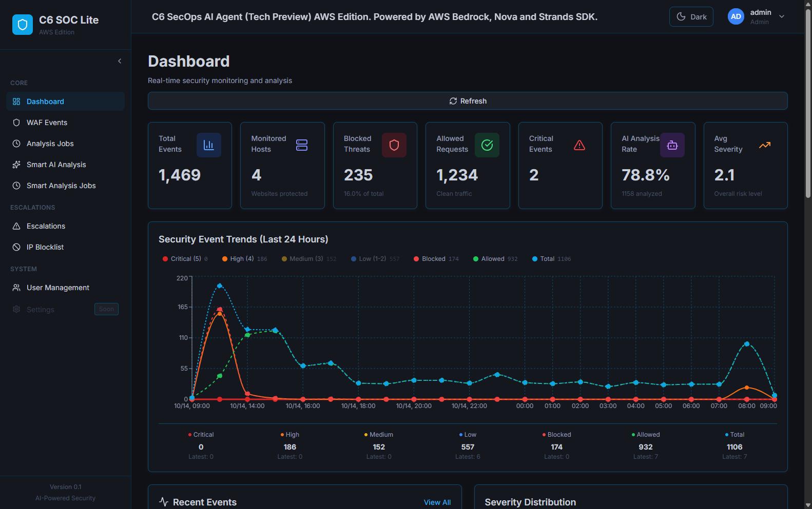
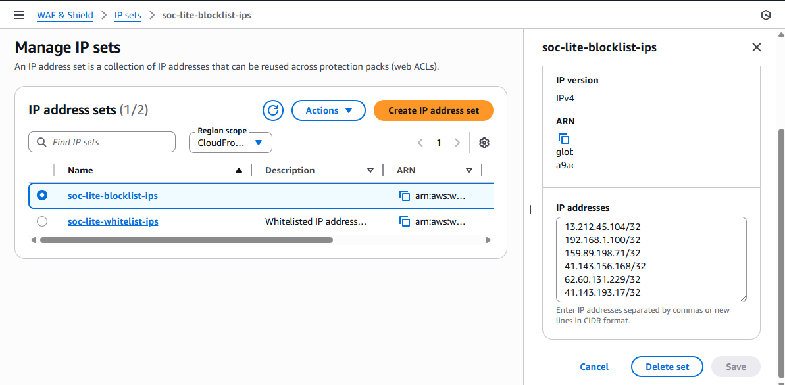
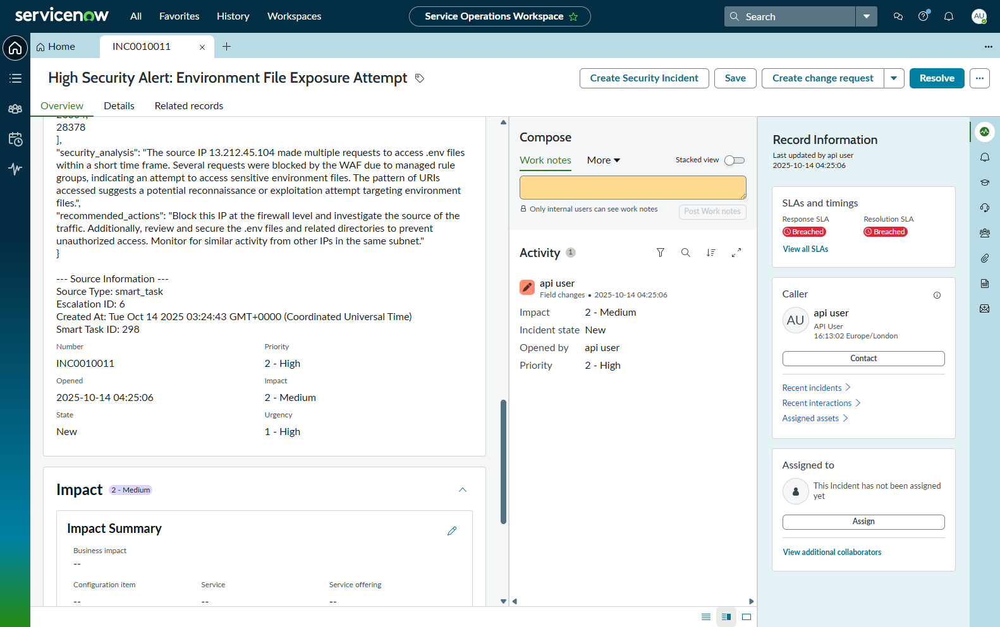
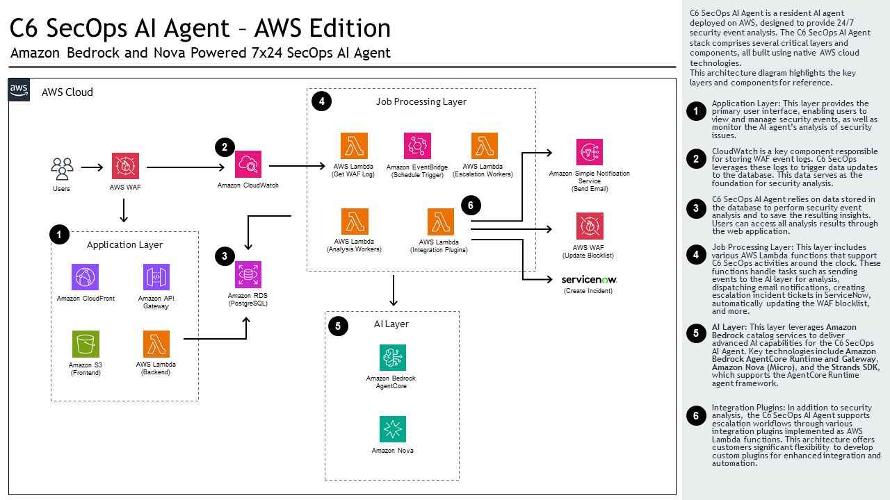

# SOC Lite C6 SecOps AI Agent - Security Operations Center (AWS Edition)

Full-stack web application for automated WAF security event analysis and threat detection built on AWS.

## Demo

[](https://youtu.be/9vPwCU_oFmA)

**📺 [Watch on YouTube](https://youtu.be/9vPwCU_oFmA)**

### Screenshots

**Dashboard**


**AWS WAF Integration**


**ServiceNow Integration**


## Project Structure

```
soc-lite/
├── apps/
│   ├── backend/              # Node.js 22.x + TypeScript + Express API
│   └── frontend/             # React 19.x + Vite 7 + TypeScript + Tailwind CSS
├── agentcore/
│   ├── gateways/             # API Gateway definitions for agent actions
│   └── runtime/              # Bedrock AgentCore agents (Python)
│       ├── secops-agent/     # Multi-agent security operations
│       └── bulk-analysis-agent/  # Bulk event analysis
├── lambda/                   # AWS Lambda functions
│   ├── get-waf-alert/        # WAF event ingestion
│   ├── smart-analysis-worker/  # Bulk AI analysis processor
│   ├── smart-analysis-task-generator/  # Event grouping
│   ├── manual-analysis-worker/  # User-triggered analysis
│   ├── escalation-processor/  # Escalation notifications
│   ├── escalation-plugin-waf-blocklist/  # WAF IP blocking
│   ├── escalation-plugin-servicenow/  # ServiceNow integration
│   ├── monitoring-trigger/   # Daily monitoring
│   └── daily-monitoring-trigger/  # Scheduled monitoring
├── database/
│   ├── migrations/           # SQL migration files
│   ├── rds/                  # RDS management scripts
│   └── scripts/              # Database helper scripts
├── infrastructure/           # AWS deployment scripts
│   ├── compute/              # Lambda, API Gateway
│   ├── storage/              # S3, RDS
│   ├── networking/           # CloudFront, DNS
│   ├── security/             # WAF, IAM
│   ├── monitoring/           # CloudWatch, EventBridge, SNS
│   ├── deployment/           # Orchestration scripts
│   └── config/               # Centralized configuration
├── config/                   # Shared configuration templates
├── scripts/                  # Deployment automation
└── DEPLOY_AWS.md             # AWS deployment guide
```

### Architecture Diagram



## Core Features

### Security Event Management
- ✅ WAF event ingestion from CloudWatch Logs
- ✅ Real-time event monitoring and analysis
- ✅ Smart event grouping by source IP and time
- ✅ Automated threat severity rating (0-5 scale)
- ✅ Event timeline and pattern detection

### AI-Powered Analysis
- ✅ AWS Bedrock AgentCore integration
- ✅ Amazon Nova Micro model for threat analysis
- ✅ Multi-agent security operations (analyze, triage, monitor)
- ✅ Bulk analysis for grouped events
- ✅ Manual analysis for individual events
- ✅ Automated security recommendations

### Escalation & Response
- ✅ Automated escalation for high-severity threats (4-5)
- ✅ SNS email notifications for critical alerts
- ✅ WAF IP blocklist integration
- ✅ ServiceNow incident creation
- ✅ Escalation tracking and management

### Dashboard & Reporting
- ✅ Real-time security metrics
- ✅ Event trends and statistics
- ✅ Attack source visualization (geographic maps)
- ✅ Severity distribution charts
- ✅ Event timeline view

### User Management
- ✅ JWT authentication (7-day expiry)
- ✅ Role-based access control
- ✅ Secure password hashing (bcrypt)
- ✅ User activity tracking

## Getting Started

### Prerequisites
- Node.js 22.x
- Python 3.8+
- PostgreSQL client (psql)
- AWS CLI v2 configured
- AWS account with Bedrock AgentCore access

### Quick Setup

1. **Clone and configure**
   ```bash
   git clone <repository-url>
   cd soc-lite
   cp config/.env.example apps/backend/.env
   # Edit apps/backend/.env with your AWS and database credentials
   ```

2. **Deploy to AWS**
   ```bash
   # See DEPLOY_AWS.md for complete deployment guide
   ./scripts/deploy.sh
   ```

### Local Development

**Backend:**
```bash
cd apps/backend
npm install
npm run dev  # Runs on http://localhost:3000
```

**Frontend:**
```bash
cd apps/frontend
npm install
npm run dev  # Runs on http://localhost:5173
```

**Database:**
```bash
cd database/rds/scripts
./start-db.sh   # Start RDS instance
./test-db.sh    # Test connection
./stop-db.sh    # Stop to save costs
```

## Architecture

### System Components

```
┌─────────────────────────────────────────────────────────┐
│                      Internet                            │
└────────────────────┬────────────────────────────────────┘
                     │
         ┌───────────┴──────────┐
         │                      │
         ▼                      ▼
┌────────────────┐    ┌────────────────┐
│   CloudFront   │    │   API Gateway  │
│   (Frontend)   │    │   (Backend)    │
│      + WAF     │    │                │
└────────┬───────┘    └────────┬───────┘
         │                     │
         ▼                     ▼
┌────────────────┐    ┌────────────────┐
│   S3 Bucket    │    │     Lambda     │
│   (React App)  │    │   (Node.js)    │
└────────────────┘    └────────┬───────┘
                               │
         ┌─────────────────────┼─────────────────┐
         │                     │                 │
         ▼                     ▼                 ▼
┌────────────────┐    ┌────────────────┐  ┌──────────┐
│  RDS Postgres  │    │    Bedrock     │  │   SNS    │
│   (Database)   │    │   AgentCore    │  │ (Alerts) │
└────────────────┘    └────────────────┘  └──────────┘
         ▲                     ▲                 ▲
         │                     │                 │
         └─────────────────────┴─────────────────┘
                       EventBridge
                    (Scheduled Triggers)
```

### Event Processing Flow

1. **Ingestion**: CloudWatch Logs → `get-waf-alert` Lambda → RDS
2. **Grouping**: `smart-analysis-task-generator` → Groups events by IP+time
3. **Analysis**: `smart-analysis-worker` → Bedrock AgentCore → AI analysis
4. **Escalation**: High-severity events → `escalation-processor` → SNS/WAF/ServiceNow
5. **Monitoring**: EventBridge → `monitoring-trigger` → Pattern detection

## Configuration

### Backend Environment Variables

See `config/.env.example` for full configuration template.

**Required settings:**
```bash
# Database (RDS PostgreSQL)
DB_HOST=your-rds-endpoint.us-east-1.rds.amazonaws.com
DB_PORT=5432
DB_NAME=agentdb
DB_USER=agenticsoc
DB_PASSWORD=your-secure-password
DB_SSL=true

# JWT Authentication
JWT_SECRET=$(openssl rand -base64 64)
JWT_EXPIRY=7d

# AWS Configuration
AWS_REGION=us-east-1
AWS_ACCOUNT_ID=123456789012

# Bedrock AgentCore (filled after agent deployment)
BEDROCK_AGENTCORE_SECOPS_AGENT_ARN=arn:aws:bedrock-agentcore:...
BEDROCK_AGENTCORE_BULK_ANALYSIS_AGENT_ARN=arn:aws:bedrock-agentcore:...

# SNS Topics
SNS_TOPIC_ARN_CRITICAL=arn:aws:sns:us-east-1:ACCOUNT:soc-lite-critical-alerts
SNS_TOPIC_ARN_MONITORING=arn:aws:sns:us-east-1:ACCOUNT:soc-lite-monitoring

# Email Alerts
ALERT_EMAIL=your-email@example.com

# CORS
CORS_ORIGIN=https://your-domain.com,http://localhost:5173
```

### Frontend Environment Variables

```bash
# Development
VITE_API_URL=http://localhost:3000/api

# Production
VITE_API_URL=https://your-domain.com/api
```

## API Endpoints

### Authentication
- `POST /api/auth/login` - User login
- `POST /api/auth/logout` - User logout
- `GET /api/auth/me` - Get current user
- `POST /api/auth/refresh` - Refresh JWT token

### Events
- `GET /api/events` - List WAF events (paginated, filterable)
- `GET /api/events/stats` - Event statistics
- `GET /api/events/:id` - Get single event
- `POST /api/events` - Create event
- `PUT /api/events/:id` - Update event
- `DELETE /api/events/:id` - Delete event
- `POST /api/events/:id/analyze` - Trigger manual AI analysis

### Escalations
- `GET /api/escalations` - List escalations
- `GET /api/escalations/:id` - Get escalation details
- `POST /api/escalations` - Create escalation
- `PUT /api/escalations/:id` - Update escalation status

### Analysis Jobs
- `GET /api/analysis-jobs` - List analysis jobs
- `GET /api/analysis-jobs/:id` - Get job details

### Agent Actions (AgentCore callbacks)
- `POST /api/agent-actions/update-event` - Update event from agent
- `POST /api/agent-actions/create-escalation` - Create escalation from agent
- `POST /api/agent-actions/bulk-update-events` - Bulk update events

## Database Schema

### Core Tables

**user_accts** - User authentication and management
- `id`, `username`, `password_hash`, `full_name`, `email`, `role`, `is_active`
- `created_at`, `updated_at`, `last_login`

**waf_log** - WAF security events
- `id`, `timestamp`, `source_ip`, `action`, `uri`, `http_method`, `country`
- `status`, `severity_rating`, `attack_type`, `security_analysis`
- `analyzed_by`, `analyzed_at`, `recommendations`

**analysis_jobs** - Manual analysis job queue
- `id`, `event_id`, `status`, `created_at`, `completed_at`

**smart_analysis_tasks** - Grouped event analysis tasks
- `id`, `source_ip`, `time_bucket`, `event_count`, `status`
- `created_at`, `processed_at`

**smart_analysis_jobs** - Bulk analysis job tracking
- `id`, `task_id`, `status`, `result`, `created_at`, `completed_at`

**escalation_events** - Security escalations
- `id`, `event_id`, `severity`, `status`, `escalation_type`
- `created_at`, `resolved_at`, `notes`

**event_timeline** - Event history tracking
- `id`, `event_id`, `action`, `details`, `created_at`

**blocklist_ip** - Blocked IP addresses
- `id`, `ip_address`, `reason`, `blocked_at`, `expires_at`

See `database/migrations/` for complete schema definitions.

## Deployment

For complete AWS deployment instructions, see **[DEPLOY_AWS.md](DEPLOY_AWS.md)**.

### Quick Deploy
```bash
# Full deployment
./scripts/deploy.sh

# Partial deployments
./scripts/deploy.sh --backend-only
./scripts/deploy.sh --frontend-only
```

The deployment guide includes:
- Prerequisites and AWS account setup
- Step-by-step deployment order
- Infrastructure provisioning
- Database setup and migrations
- Bedrock AgentCore agent deployment
- Lambda function deployment
- Frontend deployment to S3/CloudFront
- Post-deployment configuration
- Troubleshooting and monitoring

## Testing

### Backend API
```bash
# Health check
curl https://your-api-endpoint/health

# Login
curl -X POST https://your-api-endpoint/api/auth/login \
  -H "Content-Type: application/json" \
  -d '{"username":"admin","password":"your-password"}'

# Get events (with token)
curl https://your-api-endpoint/api/events \
  -H "Authorization: Bearer YOUR_TOKEN"
```

### Agent Invocation
```bash
# Test secops-agent
aws bedrock-agentcore invoke-agent \
  --agent-id secops_agent-ID \
  --agent-alias-id TSTALIASID \
  --session-id test-session \
  --input-text "Test connection" \
  --region us-east-1
```

### Database Connection
```bash
cd database/rds/scripts
./test-db.sh
```

## Monitoring

### View Logs
```bash
# Backend Lambda
aws logs tail /aws/lambda/soc-lite-backend --follow

# Agent logs
aws logs tail /aws/bedrock-agentcore/runtimes/secops_agent-ID-DEFAULT --follow

# WAF logs
aws logs tail /aws/wafv2/cloudfront/soc-lite --follow
```

### Check Metrics
```bash
# Event statistics
curl https://your-api-endpoint/api/events/stats \
  -H "Authorization: Bearer YOUR_TOKEN"

# Analysis job status
curl https://your-api-endpoint/api/analysis-jobs \
  -H "Authorization: Bearer YOUR_TOKEN"
```

## Security

### Authentication
- JWT tokens with 7-day expiry
- Bcrypt password hashing (10 rounds)
- Role-based access control (admin, user)

### Network Security
- SSL/TLS for all connections
- CORS configured for specific origins
- WAF protection on CloudFront
- RDS in private VPC (Lambda access only)

### Default Credentials
**Username**: `admin`
**Password**: Set during database migration

⚠️ **SECURITY WARNING:**
- Change the default admin password immediately after first login
- Use strong passwords (12+ characters)
- Rotate JWT secrets regularly
- Enable MFA for AWS console access
- Review IAM policies regularly

## AWS Resources

- **Region**: us-east-1
- **RDS**: PostgreSQL 14.x (db.t3.micro)
- **Lambda**: Node.js 22.x runtime
- **Bedrock**: AgentCore with Amazon Nova Micro
- **S3**: Frontend hosting
- **CloudFront**: CDN with SSL
- **WAF**: Web Application Firewall
- **SNS**: Email notifications
- **EventBridge**: Scheduled triggers

## Documentation

- **[DEPLOY_AWS.md](DEPLOY_AWS.md)** - Complete AWS deployment guide
- **[agentcore/README.md](agentcore/README.md)** - Bedrock AgentCore agents documentation
- **[lambda/README.md](lambda/README.md)** - Lambda functions documentation
- **[infrastructure/README.md](infrastructure/README.md)** - Infrastructure scripts documentation
- **[config/README.md](config/README.md)** - Configuration guide

## Troubleshooting

### Common Issues

**Database connection fails:**
```bash
cd database/rds/scripts
./status-db.sh  # Check RDS status
./start-db.sh   # Start if stopped
./test-db.sh    # Test connection
```

**Lambda deployment fails:**
```bash
# Check build
cd apps/backend
npm run build
ls -la dist/

# Check package size (should be < 50MB)
ls -lh soc-lite-backend.zip
```

**Agent invocation errors:**
```bash
# Check agent status
aws bedrock-agentcore describe-runtime --runtime-id secops_agent-ID

# View agent logs
aws logs tail /aws/bedrock-agentcore/runtimes/secops_agent-ID-DEFAULT --follow
```

**Frontend not updating:**
```bash
# Invalidate CloudFront cache
aws cloudfront create-invalidation \
  --distribution-id YOUR_DIST_ID \
  --paths "/*"
```

See [DEPLOY_AWS.md](DEPLOY_AWS.md) for detailed troubleshooting guide.

## Support

For issues or questions:
1. Check CloudWatch logs for detailed error messages
2. Review documentation in respective component directories
3. Verify AWS credentials and permissions
4. Check environment variables configuration

## License

This project is part of the SOC Lite security operations platform.
